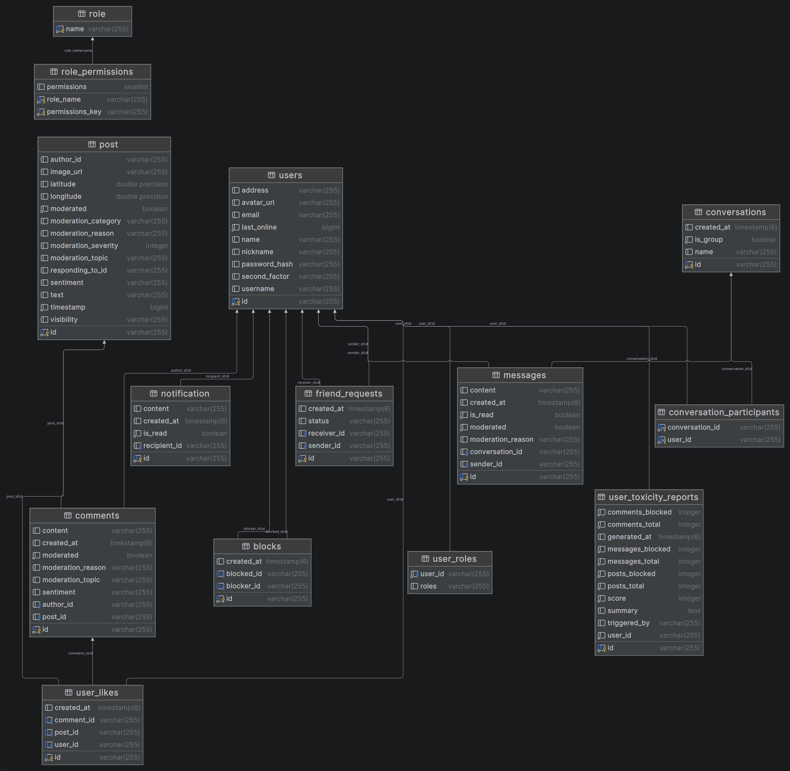

*This project has been created as part of the 42 curriculum by: jsteinka, grbuchne, ekarpawi, demrodri, atamas*
# Description
**Nearrish** is a social media platform designed to help people discover, organize, and share local events.
Its primary goal is to make event planning and community engagement simple by combining social interaction with practical event management tools.

Users can connect with friends, create and join events, and stay engaged through posts, likes, comments, and real-time chat. By bringing these features together in one place, Nearrish provides a streamlined way to plan activities and keep up with what is happening nearby.

# Instructions
## Prerequisites
- Make
- Docker and Docker Compose
- Java 25
- Next.js

## Setup
1. Create an environment file from example file:
```
cp .env.example .env
```
2. Fill in the environment variables with values
3. Create the database password secret file:
```
cp secrets/db_password.txt.example secrets/db_password.txt
```
4. Replace the value in `secrets/db_password.txt` with a secure password.

## Run The Project
- Run the `make` command
- Open the application in your browser `https://localhost`

## Useful Commands
- Start existing containers without rebuilding
```
make up
```
- Stop all services
```
make down
```
- Remove containers, volumes and project resources
```
make fclean
```


# Team Information
## jsteinka - Product Owner (PO), developer
- Maintains the product backlog.
- Makes decisions on features and priorities.
- Validates completed work.
- Communicates with stakeholders (evaluators, peers).
## grbuchne - Frontend Lead
- Owns the frontend architecture and visual direction.
- Defines UI/UX patterns, design system, and component standards.
- Ensures code quality and best practices.
- Reviews critical code changes.
## ekarpawi - Technical Lead, developer
- Defines technical architecture.
- Makes technology stack decisions.
- Ensures code quality and best practices.
- Reviews critical code changes.
## demrodri - Frontend Developer
## atamas - Product Manager (PM), developer
- Organizes team meetings and planning sessions.
- Tracks progress and deadlines.
- Ensures team communication.
- Manages risks and blockers.

# Project Management

- The team organized work by splitting features and technical tasks among members based on role and priorities.
- We held at least one online meeting per week on Discord to review progress, unblock issues, and align on next steps.
- Day-to-day coordination was handled asynchronously through Discord messages.

- GitHub Projects was used to structure and track tasks across development stages.
- GitHub Issues was used to document features, bugs, and technical improvements, with clear ownership and status updates.

- Main communication channel: Discord (weekly meetings + ongoing text coordination).
- Supporting communication: GitHub comments on issues and pull requests for technical discussions and code review feedback.

# Technical Stack

## Frontend
- **Next.js 16 (React 19, TypeScript)** for building a modern, component-based web application with routing and strong type safety.
- **CSS-in-JS with a custom design token system** — a shared set of colour, typography, shadow, and spacing tokens used consistently across all components instead of a utility framework.
- **SockJS + STOMP** for real-time communication features (chat/notifications).

**Why this choice:**  
Next.js and React provide a scalable frontend architecture, TypeScript improves maintainability, and SockJS/STOMP support reliable real-time user interactions.

## Backend
- **Java 25 + Spring Boot** as the core backend platform.
- **Python** as an additional backend platform for map and moderation service.
- **Spring MVC** for REST API development.
- **Spring Security + JWT (`java-jwt`)** for authentication and access control.
- **Spring Data JPA / JDBC + Hibernate** for data persistence and ORM.
- **Spring WebSocket** for bidirectional real-time features.

**Why this choice:**  
Spring Boot offers a mature and modular ecosystem, making it well suited for secure, production oriented backend services with both REST and WebSocket support.

## Database
- **PostgreSQL** as the primary relational database.

**Why this choice:**  
PostgreSQL is reliable, performant, and standards compliant, with strong support for relational data integrity and complex queries needed for social and event related features.

## Additional Technologies
- **Docker + Docker Compose** for containerized local development and service orchestration (frontend, backend, database, moderation service).
- **Gradle** for backend build/dependency management.
- **OpenAPI/Swagger (`springdoc-openapi`)** for API documentation and easier endpoint testing.
- **JUnit + Spring testing stack + Testcontainers** for integration and component testing.

## Major Technical Decisions (Summary)
- A **TypeScript-based Next.js frontend** was chosen for maintainability and modern UI architecture.
- A **Spring Boot backend** was selected for security, scalability, and ecosystem maturity.
- **PostgreSQL** was chosen for robust relational modeling and long term reliability.
- **Dockerized setup** was adopted to keep development environments consistent across team members.

# Database Schema



# Feature List

- **User registration and login** — secure authentication with JWT and SCrypt password hashing
- **User profiles** — view and edit your own profile, upload an avatar, view other users' profiles
- **Friends system** — send, accept, and decline friend requests; view your friends list
- **Post feed** — create posts with text, image, and location; view a personalised feed from friends
- **Explore map** — browse all public posts on an interactive map with reverse geocoding
- **Likes and comments** — interact with posts via likes and threaded comments
- **Direct messages** — real-time one-to-one chat between users
- **Group chat** — create named group conversations, add/remove members, leave and rename groups
- **Friend requests in sidebar** — accept or decline pending friend requests directly from the chat sidebar
- **Real-time notifications** — WebSocket-powered notifications for likes, comments, friend requests, and messages
- **Online status** — see which friends are currently online; status updates in real time
- **Block users** — block other users to prevent unwanted interaction
- **Admin dashboard** — manage users (view, delete, toxicity reports), view platform statistics, export data as CSV, configurable date range for post activity charts
- **Content moderation** — all posts and comments are automatically moderated by a local AI model (Qwen 2.5 3B via Ollama); flagged content is blocked before it can be published
- **Sentiment analysis** — per-post sentiment scores stored and surfaced in the admin dashboard
- **Two-factor authentication (2FA)** — TOTP-based 2FA with QR code setup in settings, enforced at login
- **Account deletion** — permanently delete your account and all associated data via a typed confirmation prompt in settings
- **Settings page** — change your display name, nickname, address, and password
- **Privacy Policy and Terms of Service** — accessible from the footer on every page

# Modules

> Total claimed: **20 points** (minimum required: 14)

| Category | Type | Module | Points | Notes |
|---|---|---|---|---|
| Web | Major | Use a framework for both frontend and backend | 2 | Next.js 16 (React/TypeScript) for frontend; Spring Boot 3 (Java) for backend |
| Web | Major | Real-time features using WebSockets | 2 | STOMP over SockJS; real-time chat, notifications, and online status broadcasting |
| Web | Major | Allow users to interact with other users | 2 | Full chat system (DMs + groups), profile pages, friends system |
| Web | Minor | Use an ORM for the database | 1 | Spring Data JPA / Hibernate |
| Web | Minor | Complete notification system | 1 | WebSocket notifications for all create/update/delete actions on social content |
| Web | Minor | File upload | 1 | Avatar upload and image attachments on posts via multipart POST, served from Docker volume |
| User Management | Major | Standard user management and authentication | 2 | Profile editing, avatar upload, friends with online status, profile pages |
| User Management | Major | Advanced permissions system | 2 | Admin role with full user CRUD, role management, admin-only dashboard views |
| User Management | Minor | Two-factor authentication (2FA) | 1 | TOTP-based 2FA; QR code setup in settings, enforced at login |
| User Management | Minor | GDPR compliance | 1 | Account deletion with full data wipe (posts, messages, toxicity reports, cascade); privacy policy page; data deletion confirmed via typed prompt |
| Artificial Intelligence | Minor | Content moderation AI | 1 | Local LLM (Qwen 2.5 3B) via Docker Model Runner moderates all posts, comments, and messages |
| Artificial Intelligence | Minor | Sentiment analysis | 1 | Per-post sentiment scores computed by moderation service and displayed in admin dashboard |
| Data and Analytics | Major | Advanced analytics dashboard with data visualization | 2 | Interactive charts (Recharts), real-time stats, configurable date ranges (7/14/30 days), CSV export |

# Individual Contributions

Development was split based on roles and what each person felt most comfortable picking up. Some parts naturally overlapped — a lot of the later work involved several people touching the same files — so the breakdown below reflects primary ownership more than exclusive work.

---

## jsteinka — Product Owner, developer

As Product Owner, Jan made the calls on what the product actually needed. When there were too many ideas on the table he decided what was essential and what could be cut, keeping the scope realistic and the team focused. He was also the one who stitched everything together — merging divergent branches from five people working in parallel, resolving conflicts, and making sure each individual contribution landed in a state where the product still worked as a whole.

On the implementation side he took on the bulk of the backend architecture: the post and feed system, the geo proxy connecting the backend to the geo-service, and the full AI moderation integration. When the team decided to add an admin dashboard he built it from scratch — live stats, interactive charts, CSV export, sentiment tracking, and user toxicity reports. He also handled a lot of the harder-to-spot issues: feed query optimisation, JPA association fixes, and the HTTPS rollout across all services. Basically whenever something broke in a non-obvious way, it ended up on his plate.

**Main areas:** product decisions and feature scoping, branch integration and merge management, post/feed API, moderation service integration, geo proxy, admin panel and analytics, HTTPS setup, backend bug fixes, backend unit testing.

---

## grbuchne — Frontend Lead

Gregor brought the visual identity of the app to life. Working on top of the initial frontend canvas that Demetrio had set up, he redesigned and iterated on it so thoroughly that the end result was barely recognisable from the starting point — and dramatically better. His background in web design and genuine interest in typography, colour theory, and UI craftsmanship showed in every decision: the colour system and design tokens that became the shared language of the frontend, the component proportions, the page layouts, and the overall feel of the application. He spent real time thinking about how the app should look before touching the code, and that saved the rest of the team from a lot of aimless iteration.

When it came to decisions about page structure, feature placement, and how the UI should behave, his opinion shaped what Nearrish actually looks like today. His TypeScript and JavaScript skills meant the frontend he left behind was clean, consistent, and easy to build on.

**Main areas:** UI/UX design direction, colour system and design tokens, full frontend redesign, component library, page structure and layout decisions, map and location integration (Nominatim reverse geocoding), explore page, code reviews.

---

## ekarpawi — Technical Lead, developer

Emil was the most experienced member of the team and it showed from day one. His choices around the technology stack, architecture patterns, and how the backend should be structured set the direction the whole project followed. When there were decisions to make about how things should fit together, his opinion carried the most weight — and he was usually right.

On the implementation side he built the authentication system from the ground up: Spring Security without the default auto-config, the custom JWT filter, SCrypt password hashing, the registration and login endpoints, and the role/permissions model. He also wrote the first real set of backend tests and fixed several issues in the authentication flow that surfaced during integration. Getting the custom filter chain right required a deep read of the Spring Security internals and ended up being one of the more technically demanding parts of the early backend work.

**Main areas:** technical architecture and stack decisions, authentication system (JWT, Spring Security, custom filter chain), user entity and roles, registration/login API, backend testing.

---

## demrodri — Frontend Developer

Demetrio laid the canvas that the frontend was painted on. He did the initial Next.js configuration, the early frontend scaffolding, and the first page drafts and component sketches — giving the team something concrete to react to and build from. That early structure was later redesigned heavily, but it was the starting point that got everyone moving. He built several modals and worked on the profile and settings pages, and added the Privacy Policy and Terms of Service pages linked from the footer.

He also did a lot of the less glamorous but genuinely valuable work: manually testing features, catching edge cases before they became bugs in integration, and flagging issues that others had missed. On the feature side he implemented two-factor authentication (TOTP-based 2FA with QR code setup in settings and enforcement at login), the account deletion cascade on the backend, and the two-step confirmation UI in the danger zone.

**Main areas:** frontend development, initial Next.js setup and scaffolding, early UI drafts, modals, profile and settings pages, two-factor authentication (2FA), privacy and terms pages, account deletion with full cascade (GDPR), frontend testing and bug reporting.

---

## atamas — Product Manager, developer

- project setup (Makefile, docker compose) for frontend and backend with nginx reverse proxy
- self signed ssl certificate on `make`
- notification system with real time feature
- API documentation with swagger
- project documentation
- PR reviews

---

# Resources

## AI Usage

AI tools were used during development for the following tasks:

- **Content moderation service** — the moderation service is the core of several modules at once: content moderation, sentiment analysis, and the data that powers the analytics dashboard are all derived from a single LLM inference pipeline. Getting it right was therefore critical. It runs on constrained hardware (8 GB RAM, limited CPU), so finding an approach that was both fast enough to be usable and accurate enough to be meaningful required a lot of iteration. AI was used to rapidly explore different prompt strategies, model quantisation tradeoffs, and inference architectures (e.g. splitting into parallel single-task calls vs. a combined prompt) to find the right compromise between responsiveness and quality without having to run every experiment manually.
- **Backend development** — drafting Spring Boot boilerplate (entity mappings, repository queries, controller skeletons) and troubleshooting Hibernate/JPA edge cases (e.g. JPQL path resolution in Hibernate 6).
- **Frontend development** — generating component scaffolding and CSS-in-JS style objects; debugging React state and WebSocket event handling.
- **Testing** — generating unit and integration test cases for controllers and services, and reviewing edge cases in authentication and moderation flows.
- **Documentation** — structuring and drafting sections of this README.

All AI-generated code was reviewed, tested, and adapted by team members before being committed.

## Frameworks and Libraries
- [Next.js](https://nextjs.org/docs) — frontend framework
- [React](https://react.dev/) — UI library
- [Spring Boot](https://docs.spring.io/spring-boot/docs/current/reference/html/) — backend framework
- [Spring Security](https://docs.spring.io/spring-security/reference/) — authentication and access control
- [Spring Data JPA](https://docs.spring.io/spring-data/jpa/docs/current/reference/html/) — database ORM
- [Spring WebSocket / STOMP](https://docs.spring.io/spring-framework/docs/current/reference/html/web.html#websocket) — real-time messaging
- [auth0/java-jwt](https://github.com/auth0/java-jwt) — JWT creation and verification
- [STOMP.js + SockJS](https://stomp-js.github.io/stomp-websocket/) — WebSocket client
- [React Leaflet](https://react-leaflet.js.org/) — interactive maps
- [Recharts](https://recharts.org/) — charts in the admin dashboard
- [FastAPI](https://fastapi.tiangolo.com/) — moderation service
- [Flask](https://flask.palletsprojects.com/) — geo service
- [springdoc-openapi](https://springdoc.org/) — Swagger / API documentation
- [Testcontainers](https://testcontainers.com/) — integration testing with real DB

## Infrastructure
- [Docker](https://docs.docker.com/) — containerization
- [Docker Compose](https://docs.docker.com/compose/) — service orchestration
- [PostgreSQL](https://www.postgresql.org/docs/) — database
- [nginx](https://nginx.org/en/docs/) — reverse proxy
- [Ollama](https://ollama.com/) / [Docker Model Runner](https://docs.docker.com/ai/model-runner/) — local LLM hosting (Qwen 2.5 3B)
- [GitHub Actions](https://docs.github.com/en/actions) — CI/CD

## Learning and Reference
- [42 ft_transcendence subject](en.subject_transcendence.pdf)
- [OWASP Top 10](https://owasp.org/www-project-top-ten/) — security checklist
- [JWT.io](https://jwt.io/) — JWT debugging tool